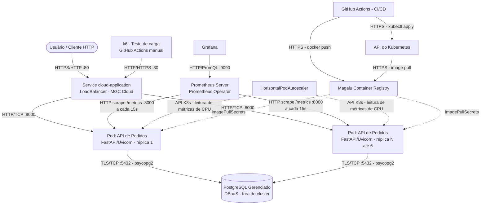

**Aluno:** Luiz Panigassi
**Repositório do Projeto:** https://github.com/luizpanigassi/move-tech-final

# Documentação de Arquitetura da Solução

## 1. Inventário de Recursos (Cluster & Cloud)

### Dentro do cluster Kubernetes (Magalu Cloud)

| Recurso | Manifesto | Descrição |
|---|---|---|
| Deployment `cloud-application` | [k8s/app.yaml](../k8s/app.yaml) | API de Pedidos (FastAPI/Uvicorn), 2 réplicas, probes de liveness/readiness em `/health`, requests/limits de CPU e memória definidos |
| Service `cloud-application` | [k8s/app.yaml](../k8s/app.yaml) | Tipo `LoadBalancer`, expõe a porta 80 → `targetPort` 8000 dos pods |
| HorizontalPodAutoscaler `cloud-application` | [k8s/hpa.yaml](../k8s/hpa.yaml) | Escala entre 2 e 6 réplicas com base em 70% de utilização de CPU (requer Metrics Server) |
| ServiceMonitor `cloud-application` | [k8s/servicemonitor.yaml](../k8s/servicemonitor.yaml) | Coleta métricas Prometheus em `/metrics` a cada 15s (requer Prometheus Operator, label `release: monitoring`) |
| Secret `registry-secret` | criado pelo workflow de deploy | Credenciais do Container Registry MGC, usado via `imagePullSecrets` |
| Secret `db-secret` | criado pelo workflow de deploy | Contém `DATABASE_URL` do PostgreSQL gerenciado, injetado na aplicação como variável de ambiente |

### Serviços externos / gerenciados (fora do cluster)

| Recurso | Descrição |
|---|---|
| PostgreSQL Gerenciado (DBaaS) | Banco relacional de pedidos/itens, acessado via `DATABASE_URL` — não roda como Pod/StatefulSet no cluster |
| Magalu Cloud Container Registry (MCR) | `container-registry.br-se1.magalu.cloud`, armazena a imagem `cloud-application` publicada a cada deploy |
| Prometheus + Grafana (stack de observabilidade) | Instalados no cluster via Prometheus Operator (assumido pela `release: monitoring`), coletam e visualizam métricas expostas pela aplicação |
| GitHub Actions | CI/CD: workflow `Deploy` ([deploy.yml](../.github/workflows/deploy.yml)) builda a imagem, publica no MCR e aplica os manifestos `k8s/`; workflow `Teste de carga (k6)` ([load-test.yml](../.github/workflows/load-test.yml)) executa testes de carga sob demanda contra a URL pública do Service |

### Componente de aplicação

- **API de Pedidos** ([app/main.py](../app/main.py)): FastAPI, expõe rotas de health (`/health`, `/stats`), pedidos (`/orders`) e itens (`/orders/{id}/items`); usa SQLAlchemy ([app/models.py](../app/models.py), [app/database.py](../app/database.py)) para persistência; logging estruturado com `structlog`; métricas expostas via `prometheus-fastapi-instrumentator`; documentação interativa via Scalar em `/docs`.
- **Local (docker-compose)**: para desenvolvimento, [docker-compose.yml](../docker-compose.yml) sobe a API e um container `postgres:16` — usado **apenas localmente**, não representa a topologia de produção.

## 2. Diagrama C2 (Nível de Containers)

## 3. Requisitos Não-Funcionais (RNFs) & Estilo Arquitetural

- **Estilo Arquitetural:** Monolito Modular em camadas (API / domínio / persistência), implantado como serviço único cloud-native em contêineres, com banco de dados gerenciado externo ao cluster e escalonamento horizontal automatizado (HPA).
- **Disponibilidade Alvo (SLA):** 99.9% — garantida por 2 réplicas mínimas do Deployment, probes de liveness/readiness em `/health` e PostgreSQL gerenciado com backup/failover pelo provedor.
- **Latência Alvo (P95):** < 500 ms sob carga (SLO validado pelo workflow de teste de carga k6, parâmetro `p95_alvo_ms`, padrão 500 ms).
- **Vazão Alvo (RPS):** cenário de teste padrão de 20 usuários virtuais simultâneos sustentados por 2 minutos ([load/k6/load-test.js](../load/k6/load-test.js)); o HPA permite escalar de 2 para até 6 réplicas para absorver picos acima da capacidade de uma réplica.
- **Teto de Custo (FinOps):** R$ 150,00/mês — cobre 2 a 6 réplicas com `requests` de 100m CPU / 128Mi e `limits` de 500m CPU / 256Mi por pod, o Service `LoadBalancer` e a instância de PostgreSQL gerenciado.
